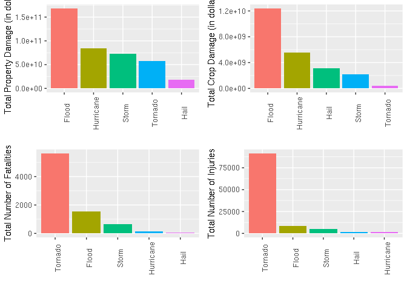

## Synopsis

With scarce resources, it is important to make the right decisions at strategic points in order to minimize impacts on the population and the economy.
This study aims to guide public managers on which natural phenomena have the potential to cause the greatest disturbance in the society, in order to take measures to mitigate negative effects on it. 


## Data Processing

Before even starting to download the data, the environment is configured.


```r
library(tidyverse)
library(magrittr)
library(data.table)
library(R.utils)
library(egg)
library(cowplot)
```


To perform this analysis, the data is downloaded from the coursera's [course project](https://www.coursera.org/learn/reproducible-research/peer/OMZ37/course-project-2).
Dataset is saved in `data/storm_data.csv.bz2`, and extracted to `data/storm_data.csv`.
Also, two files that contain explanation about the data are downloaded and save as
`data/storm_data_documentation.pdf` and 
`data/storm_data_faq.pdf`.


```r
# set paths and urls
stormdata_url      <- "https://d396qusza40orc.cloudfront.net/repdata%2Fdata%2FStormData.csv.bz2"
stormdata_path     <- "data/stormdata.csv.bz2"
stormdata_doc_url  <- "https://d396qusza40orc.cloudfront.net/repdata%2Fpeer2_doc%2Fpd01016005curr.pdf"
stormdata_doc_path <- "data/storm_data_documentation.pdf"
stormdata_faq_url  <- "https://d396qusza40orc.cloudfront.net/repdata%2Fpeer2_doc%2FNCDC%20Storm%20Events-FAQ%20Page.pdf"
stormdata_faq_path <- "data/storm_data_faq.pdf"

# create ./data folder if it does not exists yet.
if (!dir.exists(dirname(stormdata_path))) {
    dir.create(dirname(stormdata_path))
}

# download data file if it is not yet in disk
if (!file.exists(stormdata_path)) {
    download.file(stormdata_url, stormdata_path, "curl")
}

# download documentation file if it is not yet in disk
if (!file.exists(stormdata_doc_path)) {
    download.file(stormdata_doc_url, stormdata_doc_path, "curl")
}

# download FAQ file if it is not yet in disk
if (!file.exists(stormdata_faq_path)) {
    download.file(stormdata_faq_url, stormdata_faq_path, "curl")
}

# after download, data is extracted
stormdata_file <- "data/stormdata.csv"
if (!file.exists(stormdata_file)) {
   bunzip2(filename = stormdata_path,
           destname = stormdata_file,
           remove   = FALSE) 
}
```

After download, data is loaded into `R` session.
I opted to create a binary file in `.rds` format to avoid parse the raw `.csv` file every time.
This file is located at `data/stormdata.rds`


```r
# Load data

## check if the parsed binary exists.
## If doesn't exist, parse raw data
stormdata_parsed <- "data/stormdata.rds"

if(!file.exists(stormdata_parsed)) {
    storm <- read_csv(stormdata_file,
        trim_ws = TRUE,
        col_types = cols_only(
            STATE      = "c",
            EVTYPE     = "c",
            FATALITIES = "d",
            INJURIES   = "d",
            PROPDMG    = "d",
            PROPDMGEXP = "c",
            CROPDMG    = "d",
            CROPDMGEXP = "c"))
    write_rds(storm, stormdata_parsed)
} else {
    storm <- read_rds(stormdata_parsed)
}
```


After load data, the colunms are modified to a more tidy format.
In this dataset, suffix like `K`, `M` and `B` where used to express expoents.
1000, 10^{6} and 10^{9} respectively.


```r
# map `k`, `m` and `b` to powers of ten
storm %<>% mutate(PROPDMGEXP = case_when(str_to_lower(PROPDMGEXP) == "k" ~ 1E3,
                                        str_to_lower(PROPDMGEXP) == "m" ~ 1E6,
                                        str_to_lower(PROPDMGEXP) == "b" ~ 1E9,
                                        str_detect(
                                            str_to_lower(PROPDMGEXP), "^[0-9]$") ~ 10^as.numeric(PROPDMGEXP)))
                                        
storm %<>% mutate(CROPDMGEXP = case_when(str_to_lower(CROPDMGEXP) == "k" ~ 1E3,
                                        str_to_lower(CROPDMGEXP) == "m" ~ 1E6,
                                        str_to_lower(CROPDMGEXP) == "b" ~ 1E9,
                                        str_detect(
                                            str_to_lower(CROPDMGEXP), "^[0-9]$") ~ 10^as.numeric(CROPDMGEXP)))

# transform `PROPDMG` and `CROPDMG` to actual values in dollar
storm %<>%
    mutate(PROPDMG = PROPDMG * PROPDMGEXP,
                 CROPDMG = CROPDMG * CROPDMGEXP) %>% 
    select(-ends_with("EXP"))

# map event types to actual factors
storm %<>% mutate(ev = case_when(str_detect(str_to_upper(EVTYPE), "HAIL") ~ "HAIL",
                                     str_detect(str_to_upper(EVTYPE), "BURST") ~ "MICROBURST",
                                     str_detect(str_to_upper(EVTYPE), "AVALANCHE") ~ "AVALANCHE",
                                     str_detect(str_to_upper(EVTYPE), "DAM ") ~ "DAM BREAK",
                                     str_detect(str_to_upper(EVTYPE), "TORNADO") ~ "TORNADO",
                                     str_detect(str_to_upper(EVTYPE), "HURRICANE") ~ "HURRICANE",
                                     str_detect(str_to_upper(EVTYPE), "TYPHOON") ~ "TYPHOON",
                                     str_detect(str_to_upper(EVTYPE), "SURF") ~ "HIGH SURF",
                                     str_detect(str_to_upper(EVTYPE), "LANDSLIDE|MUDSLIDE") ~ "LANDSLIDE",
                                     str_detect(str_to_upper(EVTYPE), "TSUNAMI") ~ "TSUNAMI",
                                     str_detect(str_to_upper(EVTYPE), "FLOOD|STREAM") ~ "FLOOD",
                                     str_detect(str_to_upper(EVTYPE), "LIGHTNING") ~ "LIGHTNING",
                                     str_detect(str_to_upper(EVTYPE), "SNOW|BLIZZARD|ICE") ~ "SNOW",
                                     str_detect(str_to_upper(EVTYPE), "STORM|RAIN") ~ "STORM",
                                     str_detect(str_to_upper(EVTYPE), "CLOUD|FOG|SMOKE") ~ "CLOUD",
                                     str_detect(str_to_upper(EVTYPE), "WATERSPOUT") ~ "WATERSPOUT",
                                     str_detect(str_to_upper(EVTYPE), "GLAZE") ~ "GLAZE",
                                     str_detect(str_to_upper(EVTYPE), "FUNNEL") ~ "FUNNEL",
                                     str_detect(str_to_upper(EVTYPE), "VOLCAN") ~ "VOLCANO",
                                     str_detect(str_to_upper(EVTYPE), "FIRE") ~ "FIRE",
                                     str_detect(str_to_upper(EVTYPE), "TIDE") ~ "TIDE",
                                     str_detect(str_to_upper(EVTYPE), "DROUGHT|DUST DEVIL") ~ "DROUGHT",
                                     str_detect(str_to_upper(EVTYPE), "HEAT") ~ "HEAT",
                                     str_detect(str_to_upper(EVTYPE), "COLD|FREEZE") ~ "COLD",
                                     str_detect(str_to_upper(EVTYPE), "WIND") ~ "WIND",
                                     str_detect(str_to_upper(EVTYPE), "WEATHER") ~ "WEATHER")) %>% 
    mutate(ev = factor(str_to_title(ev))) %>% 
    group_by(ev) %>% 
    arrange(desc(FATALITIES), desc(INJURIES), desc(PROPDMG), desc(CROPDMG))
```

After processing, the dataframe looks like this:


```r
num_of_factors <- storm$ev %>% unique() %>% length()
set.seed(2)
storm_sample <- storm %>% group_by(ev) %>% sample_n(1)
knitr::kable(head(storm_sample, n = num_of_factors), booktabs = TRUE)
```


STATE   EVTYPE                   FATALITIES   INJURIES   PROPDMG   CROPDMG  ev         
------  ----------------------  -----------  ---------  --------  --------  -----------
CO      AVALANCHE                         0          0        NA        NA  Avalanche  
CO      FUNNEL CLOUD                      0          0        NA        NA  Cloud      
IN      EXTREME COLD                      0          0        NA        NA  Cold       
ME      DAM BREAK                         0          0     1e+06        NA  Dam Break  
MO      DROUGHT                           0          0     0e+00     0e+00  Drought    
AZ      WILD/FOREST FIRE                  0          0        NA        NA  Fire       
WI      FLASH FLOOD                       0          0     3e+04        NA  Flood      
TX      FUNNEL                            0          0        NA        NA  Funnel     
OH      GLAZE                             0          8        NA        NA  Glaze      
KS      HAIL                              0          0     0e+00     0e+00  Hail       
CA      HEAT                              0          0        NA        NA  Heat       
OR      HIGH SURF                         0          0     0e+00     0e+00  High Surf  
NC      HURRICANE EMILY                   0          1     5e+07        NA  Hurricane  
PR      LANDSLIDE                         0          0     0e+00     0e+00  Landslide  
CA      LIGHTNING                         0          0        NA        NA  Lightning  
MT      DRY MICROBURST                    0          0     1e+04        NA  Microburst 
MA      HEAVY SNOW                        0          0     0e+00     0e+00  Snow       
IL      THUNDERSTORM WIND                 0          0     5e+02        NA  Storm      
LA      ASTRONOMICAL LOW TIDE             0          0     0e+00     0e+00  Tide       
UT      TORNADO                           0          0     5e+04        NA  Tornado    
CA      TSUNAMI                           0          0     0e+00     0e+00  Tsunami    
GU      TYPHOON                           0          0     4e+05     6e+05  Typhoon    
GU      VOLCANIC ASH                      0          0        NA        NA  Volcano    
GM      WATERSPOUT                        0          0        NA        NA  Waterspout 
PA      WINTER WEATHER/MIX                0          0        NA        NA  Weather    
NC      TSTM WIND                         0          0     1e+03        NA  Wind       
FL      RIP CURRENTS                      1          1        NA        NA  NA         

## Results


```r
storm_plot_subset <- storm %>% 
                        group_by(ev) %>% 
                        summarise(PROPDMG = sum(PROPDMG, na.rm = T),
                                  CROPDMG = sum(CROPDMG, na.rm = T),
                                  FATALITIES = sum(FATALITIES, na.rm = T),
                                  INJURIES = sum(INJURIES, na.rm = T)) %>% 
                        arrange(-PROPDMG, -CROPDMG, -FATALITIES, -INJURIES) %>% 
                        mutate(e = factor(ev, ev)) %>% 
                        head(n = 5)

plot_total_propdmg <- storm_plot_subset %>% 
                        arrange(-PROPDMG) %>% 
                        mutate(e = factor(ev, ev)) %>% 
                        ggplot(aes(x = e, y = PROPDMG, fill = e)) +
                            theme(axis.text.x = element_text(angle = 90),
                                  legend.position = "none") +
                            labs(x = "",
                                 y = "Total Property Damage (in dollars)",
                                 fill = "") +
                            geom_bar(stat = "identity") 

plot_total_cropdmg <- storm_plot_subset %>% 
                        arrange(-CROPDMG) %>% 
                        mutate(e = factor(ev, ev)) %>% 
                        ggplot(aes(x = e, y = CROPDMG, fill = e)) +
                            theme(axis.text.x = element_text(angle = 90),
                                  legend.position = "none") +
                            labs(x = "",
                                 y = "Total Crop Damage (in dollars)",
                                 fill = "") +
                            geom_bar(stat = "identity") 

plot_total_fatalities <- storm_plot_subset %>% 
                            arrange(-FATALITIES) %>% 
                            mutate(e = factor(ev, ev)) %>% 
                            ggplot(aes(x = e, y = FATALITIES, fill = e)) +
                                theme(axis.text.x = element_text(angle = 90),
                                   legend.position = "none") +
                                labs(x = "",
                                     y = "Total Number of Fatalities",
                                     fill = "") +
                                geom_bar(stat = "identity") 

plot_total_injuries <- storm_plot_subset %>% 
                        arrange(-INJURIES) %>% 
                        mutate(e = factor(ev, ev)) %>% 
                        ggplot(aes(x = e, y = INJURIES, fill = e)) +
                            theme(axis.text.x = element_text(angle = 90),
                               legend.position = "none") +
                            labs(x = "",
                                 y = "Total Number of Injuries",
                                 fill = "") +
                            geom_bar(stat = "identity") 

panel_plot1 <- plot_grid(plot_total_propdmg,
                            plot_total_cropdmg,
                            plot_total_fatalities,
                            plot_total_injuries,
                            ncol = 2)
panel_plot1
```

<!-- -->


Analysing this plot we can see that **Floods** are the main natural phenomena that affects the economy in the US, folowed by **Hurricanes**. Also, we can see that **Tornados** are by far the major factor directly influencing people.


(I couldn't find a way to add captions to plots that were "merged", neither how to adjust image canvas to fit the Y-axis label. I apologize)
