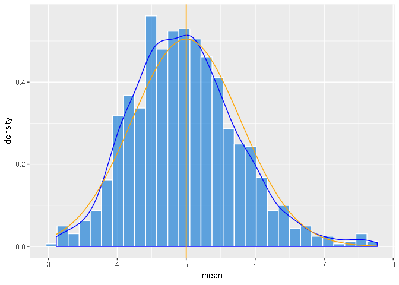

# Overview

In this project I aim to present you how a randomly generated exponential distribution sample relates to the Central Limit Theorem (CLT from now on).
I'll present basicaly 3 points related to this theme:

 1. Show the sample mean and compare it to the theoretical mean of the distribution.
 2. Show how variable the sample is (via variance) and compare it to the theoretical variance of the distribution.
 3. Show that the distribution is approximately normal.
 
## Setting up the enviroment

Before we start, we need to setup the enviroment


```r
library(tidyverse)
library(magrittr)
```

Now, we can start to analyse the distribuitions.

# Simulations

## Sample Mean versus Theoretical Mean & Distribution comparisons


```r
# we need to set seed to ensure reproducibility
# the seed I choose is the number of seconds since 
# 1 Jan 1970
set.seed(1591274018)

# now, we need to set the parameters to the
# exponential distribuition
lambda <- 0.2

# we will perform 1000 simulations
simulations <- 1E3

# and we will use 40 samples to do the comparisons
samples <- 40

# now we generate a sample of exponential distribuitions
# this will be a tibble with 1000 rows and 40 collunms
# we need this to have a more tidy dataframe to work with
exponential_sample <- matrix(data = rexp(samples * simulations, lambda), nrow = simulations) %>%
                        as_tibble()

# now we creat another column, named "mean", to store the mean
# of each row
exponential_sample %<>% mutate(mean = rowMeans(.))

# finaly, we creat a subset frame with only the mean of the means
exponential_mean <- exponential_sample %>% summarise(exponential_mean = mean(mean))

# and a theoretical distribuition tibble for comparison
exponential_sample %<>%
                        mutate(x = sort(mean)) %>% 
                        mutate( y = dnorm(.$x, mean = (1/lambda), sd = ( (1/lambda) / sqrt(samples))))
```

With all the data generated, now we plot the results


```r
# plot of the sample distribution
plot1 <- ggplot(exponential_sample) +
                    geom_histogram(aes(x = mean, y = ..density.. ),
                        color = "white",
                        fill = "#2182d7",
                        alpha = .7) +
                    geom_density(aes(mean), color = "blue")

# plot of the theoretical distribution
plot1 %<>% + geom_line(aes(x, y),
                color = "orange") +
             geom_vline(xintercept = 1 / lambda,
                        size = .6,
                        color = "orange")
```

<!-- -->

(I had some trouble in putting the legend in this plot.)
But, as we can see the sample and theoretical values are pretty close from one another.

## Sample Variance versus Theoretical Variance

In order to compare the means and variances between **Sample** and **Theoretical** values, I made this table:


```r
exponential_comparison <- tibble(name = character(), mean = double(), variance = double())
exponential_comparison %<>% add_row(name = "Sample",
                                    mean = mean(exponential_sample$mean),
                                    variance = var(exponential_sample$mean)) %>% 
                            add_row(name = "Theoretical",
                                    mean = (1/lambda),
                                    variance = (1/((lambda^2) * samples)))
knitr::kable(exponential_comparison, caption = 'Comparison between "Sample" and "Theoretical" values.')
```


Table: Comparison between "Sample" and "Theoretical" values.

name               mean    variance
------------  ---------  ----------
Sample         4.979784   0.5925396
Theoretical    5.000000   0.6250000

As you can see, the mean and variance in Sample and in Theory are pretty close.

