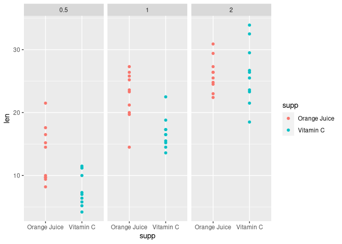
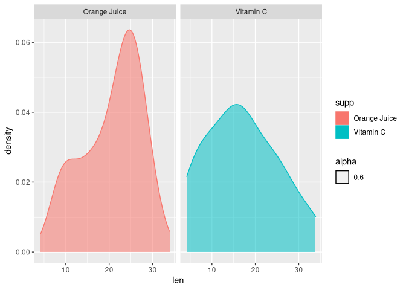
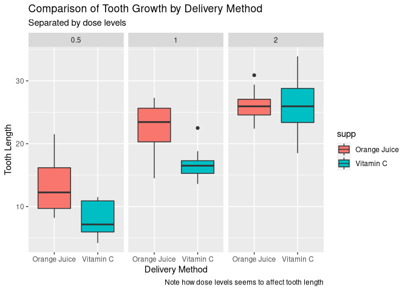
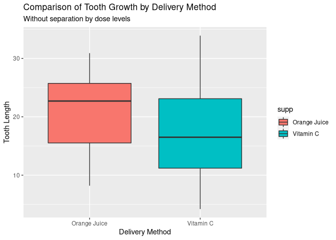

# Abstract

In this report we will explore some basic informations about tooth growth related to different doses of vitamin C in pigs.
I'll briefly describe some exploratory data analysis (EDA) performed, and after that present the results and a short discussion.

# Methods

We start setting the environment and loading the ToothGrowth dataset, a built-in dataframe from R.
This is the description of the data:

> <sub>The response is the length of odontoblasts (cells responsible for tooth growth) in 60 guinea pigs. Each animal received one of three dose levels of vitamin C (0.5, 1, and 2 mg/day) by one of two delivery methods, orange juice or ascorbic acid (a form of vitamin C and coded as VC).</sub>


## Exploratory Data Analysis


```r
library(tidyverse)
library(pairwiseComparisons)

# for reproducibility we need to set seed
set.seed(42)
```


```r
df <- as_tibble(ToothGrowth) %>%
    mutate(supp = case_when(
        supp == "VC" ~ "Vitamin C",
        supp == "OJ" ~ "Orange Juice"
    )) %>% 
    group_by(supp, dose)

knitr::kable(head(sample_n(df, 1)))
```


  len  supp            dose
-----  -------------  -----
 15.2  Orange Juice     0.5
 20.0  Orange Juice     1.0
 25.5  Orange Juice     2.0
  5.2  Vitamin C        0.5
 15.5  Vitamin C        1.0
 25.5  Vitamin C        2.0


```r
ggplot(df) +
    geom_point(aes(supp, len, color = supp)) +
    facet_grid(. ~ dose)
```

<!-- -->

```r
ggplot(df) +
    geom_density(aes(len, color = supp, fill = supp, alpha = 0.6)) +
    facet_wrap( ~ supp)
```

<!-- -->


## Visualy Analysing Data


```r
ggplot(df) +
    geom_boxplot(aes(supp, len, fill = supp)) +
    facet_wrap( ~ dose) +
    labs(
        title = "Comparison of Tooth Growth by Delivery Method",
        subtitle = "Separated by dose levels",
        x = "Delivery Method",
        y = "Tooth Length",
        caption = "Note how dose levels seems to affect tooth length")
```

<!-- -->


```r
ggplot(df) +
    geom_boxplot(aes(supp, len, fill = supp)) +
    labs(
        title = "Comparison of Tooth Growth by Delivery Method",
        subtitle = "Without separation by dose levels",
        x = "Delivery Method",
        y = "Tooth Length")
```

<!-- -->


## Hypothesis

As we can see in the plots there seams to exist a relationship in regard to the dose levels.
It's harder to say the same about the two different delivery methods.
Let's perform some statistical analysis to assess the significance for this two types of variance:

 - Assess if delivery methods are significant to tooth growth.


```r
hypothesis_delivery_method <- t.test(df$len ~ df$supp, paired = FALSE)
hypothesis_delivery_method
```

```
## 
## 	Welch Two Sample t-test
## 
## data:  df$len by df$supp
## t = 1.9153, df = 55.309, p-value = 0.06063
## alternative hypothesis: true difference in means is not equal to 0
## 95 percent confidence interval:
##  -0.1710156  7.5710156
## sample estimates:
## mean in group Orange Juice    mean in group Vitamin C 
##                   20.66333                   16.96333
```


 - Assess if dose levels are significant to tooth growth.
 
 

```r
df_0.5_1 <- df %>% filter(dose == 0.5 | dose == 1)
df_0.5_2 <- df %>% filter(dose == 0.5 | dose == 2)
df_1_2 <- df %>% filter(dose == 1 | dose == 2)

hypothesis_dose_level_0.5_1 <- t.test(df_0.5_1$len ~ df_0.5_1$dose)
hypothesis_dose_level_0.5_2 <- t.test(df_0.5_2$len ~ df_0.5_2$dose)
hypothesis_dose_level_1_2 <- t.test(df_1_2$len ~ df_1_2$dose)
```
 
   - Analyzing the results
     - Test 1: dose = 0.5 and dose = 1
     
     ```r
     hypothesis_dose_level_0.5_1
     ```
     
     ```
     ## 
     ## 	Welch Two Sample t-test
     ## 
     ## data:  df_0.5_1$len by df_0.5_1$dose
     ## t = -6.4766, df = 37.986, p-value = 1.268e-07
     ## alternative hypothesis: true difference in means is not equal to 0
     ## 95 percent confidence interval:
     ##  -11.983781  -6.276219
     ## sample estimates:
     ## mean in group 0.5   mean in group 1 
     ##            10.605            19.735
     ```
     - Test 2: dose = 0.5 and dose = 2 
     
     ```r
     hypothesis_dose_level_0.5_2
     ```
     
     ```
     ## 
     ## 	Welch Two Sample t-test
     ## 
     ## data:  df_0.5_2$len by df_0.5_2$dose
     ## t = -11.799, df = 36.883, p-value = 4.398e-14
     ## alternative hypothesis: true difference in means is not equal to 0
     ## 95 percent confidence interval:
     ##  -18.15617 -12.83383
     ## sample estimates:
     ## mean in group 0.5   mean in group 2 
     ##            10.605            26.100
     ```
     - Test 3: dose = 1 and dose = 2 
     
     ```r
     hypothesis_dose_level_1_2
     ```
     
     ```
     ## 
     ## 	Welch Two Sample t-test
     ## 
     ## data:  df_1_2$len by df_1_2$dose
     ## t = -4.9005, df = 37.101, p-value = 1.906e-05
     ## alternative hypothesis: true difference in means is not equal to 0
     ## 95 percent confidence interval:
     ##  -8.996481 -3.733519
     ## sample estimates:
     ## mean in group 1 mean in group 2 
     ##          19.735          26.100
     ```
     
 
# Conclusion

Reading the result of this analysis, we can conclude that it's indeed statistically significant the _dose_ variable,
i.e. as we increase the dose, so does the length of the teeth. 
In the other hand, we can't say the same about how vitamin C is delivered.  
For this conclusion I'm assuming that only p-values equal of less than 0.05 (5%) are statistically significant.
