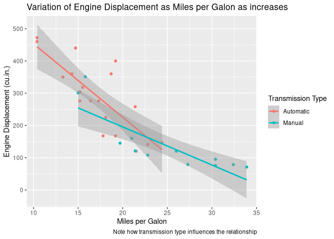
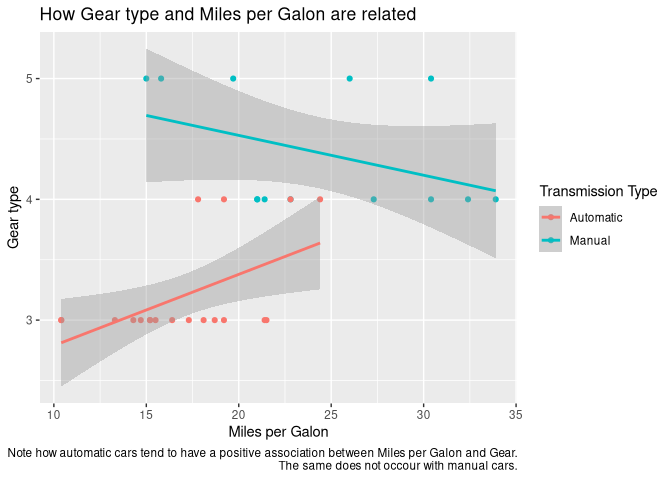
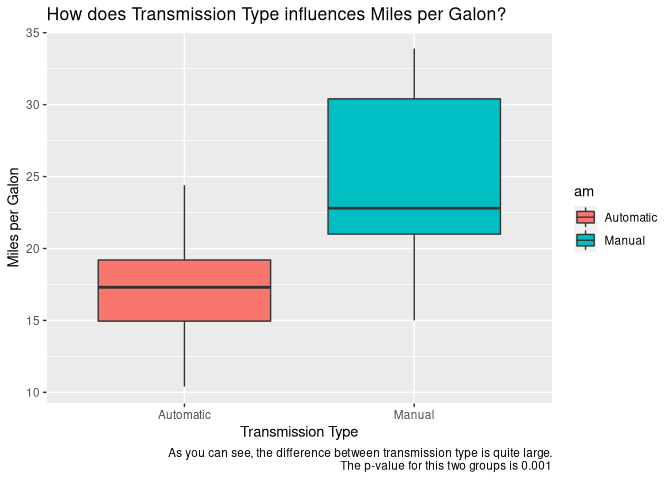
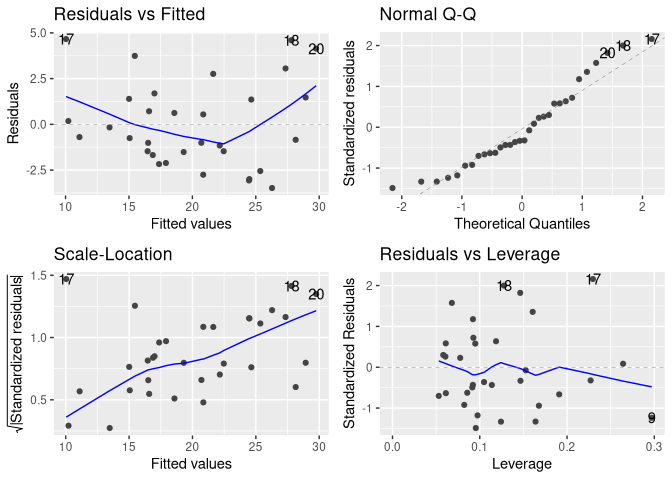

# Executive Summary

In this post we'll perform some data analysis in regard to transmission type and miles per gallon (MPG).
We'll seek to answer 2 main questions:

 - “Is an automatic or manual transmission better for MPG”? 
 
 - How can we "Quantify the MPG difference between automatic and manual transmissions"?

# Data Exploration

## Introduction to dataframe used

We are going to use a famous dataframe in R, called `mtcars`.
Here is a brief explanation about it:

><sub>The data was extracted from the 1974 Motor Trend US magazine, and comprises fuel consumption and 10 aspects of automobile design and performance for 32 automobiles (1973–74 models).</sub>

><sub>Format:
A data frame with 32 observations on 11 (numeric) variables.
<br />[, 1]	mpg	Miles/(US) gallon
<br />[, 2]	cyl	Number of cylinders
<br />[, 3]	disp	Displacement (cu.in.)
<br />[, 4]	hp	Gross horsepower
<br />[, 5]	drat	Rear axle ratio
<br />[, 6]	wt	Weight (1000 lbs)
<br />[, 7]	qsec	1/4 mile time
<br />[, 8]	vs	Engine (0 = V-shaped, 1 = straight)
<br />[, 9]	am	Transmission (0 = automatic, 1 = manual)
<br />[,10]	gear	Number of forward gears
<br />[,11]	carb	Number of carburetors</sub>


## Load data and process it

In this section we load libraries, load data and modify it to a more tidy form.


```r
library(tidyverse)
library(magrittr)
library(GGally)
library(knitr)
library(glue)
library(ggfortify)
library(broom)

# set seed for reproducibility
set.seed(1)

d <- mtcars %>%
        as_tibble() %>% 
        mutate(am = factor(am, labels = c("Automatic", "Manual")),
               vs = factor(vs, labels = c("V", "S")),
               cyl = factor(cyl))

summary_d <- tibble(
    "Number of Rows" = nrow(d),
    "Number of Colunms" = ncol(d)
)

# show dataframe info
kable(
    summary_d,
    caption = "A summary of the dimensions of `mtcars` dataframe"
    )
```


Table: A summary of the dimensions of `mtcars` dataframe

 Number of Rows   Number of Colunms
---------------  ------------------
             32                  11

```r
kable(
    sample_n(d, 5),
    caption = "A quick look at the raw data"
)
```


Table: A quick look at the raw data

  mpg  cyl    disp    hp   drat      wt    qsec  vs   am           gear   carb
-----  ----  -----  ----  -----  ------  ------  ---  ----------  -----  -----
 19.2  8       400   175   3.08   3.845   17.05  V    Automatic       3      2
 21.4  6       258   110   3.08   3.215   19.44  S    Automatic       3      1
 14.3  8       360   245   3.21   3.570   15.84  V    Automatic       3      4
 21.0  6       160   110   3.90   2.620   16.46  V    Manual          4      4
 21.0  6       160   110   3.90   2.875   17.02  V    Manual          4      4


## Basic visualization of the data

Here we show some basic plots demonstrating properties of the data.


```r
ggplot(d) +
    geom_point(aes(mpg, disp, color = am)) +
    geom_smooth(aes(mpg, disp, color = am), method = "lm") +
    labs(
        title = "Variation of Engine Displacement as Miles per Galon as increases",
        caption = "Note how transmission type influences the relationship",
        x = "Miles per Galon",
        y = "Engine Displacement (cu.in.)"
    ) +
    scale_color_discrete(name = "Transmission Type")
```

<!-- -->

```r
ggplot(d) +
    geom_point(aes(mpg, gear, color = am)) +
    geom_smooth(aes(mpg, gear, color = am), method = "lm") +
    labs(
        title = "How Gear type and Miles per Galon are related",
        caption = "Note how automatic cars tend to have a positive association between Miles per Galon and Gear.
        The same does not occour with manual cars.",
        x = "Miles per Galon",
        y = "Gear type"
    ) +
    scale_color_discrete(name = "Transmission Type")
```

<!-- -->

```r
plot_t.test <- t.test(d$mpg ~ d$am)
ggplot(d) +
    geom_boxplot(aes(am, mpg, fill = am)) +
    scale_color_discrete(name = "Transmission Type") +
    labs(
        title = "How does Transmission Type influences Miles per Galon?",
        x = "Transmission Type",
        y = "Miles per Galon",
        caption = glue(
            "As you can see, the difference between transmission type is quite large.
            The p-value for this two groups is {round(plot_t.test$p.value, 3)}
            "
        )
    )
```

<!-- -->

```r
kable(plot_t.test$estimate, caption = "Summary of variation between transmission types")
```


Table: Summary of variation between transmission types

                                  x
------------------------  ---------
mean in group Automatic    17.14737
mean in group Manual       24.39231

## Modeling data

Now we go one step further and perform some statistical modeling.


```r
cars_t.test <- t.test(d$mpg ~ d$am) %>% 
                tidy()
kable(cars_t.test, caption = "Student's T-test for `mtcars` dataframe")
```


Table: Student's T-test for `mtcars` dataframe

  estimate   estimate1   estimate2   statistic     p.value   parameter    conf.low   conf.high  method                    alternative 
----------  ----------  ----------  ----------  ----------  ----------  ----------  ----------  ------------------------  ------------
 -7.244939    17.14737    24.39231   -3.767123   0.0013736    18.33225   -11.28019   -3.209684  Welch Two Sample t-test   two.sided   

```r
cars_regression <- lm(mpg ~ ., data = d) %>%
                tidy()
kable(cars_regression, caption = "Linear Regression Model for `mtcars` dataframe")
```


Table: Linear Regression Model for `mtcars` dataframe

term             estimate    std.error    statistic     p.value
------------  -----------  -----------  -----------  ----------
(Intercept)    17.8198433   16.3060232    1.0928381   0.2874542
cyl6           -1.6603067    2.2622966   -0.7339032   0.4715245
cyl8            1.6374398    4.3157345    0.3794116   0.7083808
disp            0.0139124    0.0174018    0.7994830   0.4334036
hp             -0.0461284    0.0271202   -1.7008869   0.1044619
drat            0.0263503    1.6764895    0.0157175   0.9876155
wt             -3.8062476    1.8466431   -2.0611712   0.0525285
qsec            0.6469571    0.7219502    0.8961242   0.3808461
vsS             1.7473869    2.2726721    0.7688689   0.4509559
amManual        2.6172655    2.0047494    1.3055325   0.2065309
gear            0.7640292    1.4566802    0.5245003   0.6056959
carb            0.5093512    0.9424418    0.5404590   0.5948487

Finally we make a panel plot to show how is the residual of the model. 


```r
cars_model <- lm(mpg ~ ., data = d)
plot_residual <- autoplot(
                    step(cars_model,
                         direction="both",
                         trace=FALSE)
)
plot_residual
```

<!-- -->


# Conclusions

As we can see from this tables and plots, MPG values tend to be highly influence by gear type.
Answering our initial questions:

 - “Is an automatic or manual transmission better for MPG”? 
 
    - Answer: Cars with manual transmissions are generally better when seeking better miles per gallon values.
 
 
 - How can we "Quantify the MPG difference between automatic and manual transmissions"?

    - Answer: Looking at the previous boxplot and t.test we can easily quantify this difference.
