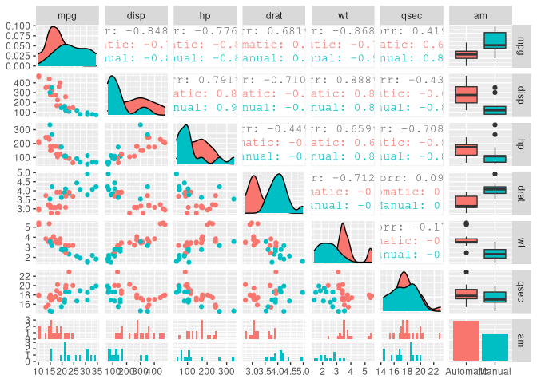

# Overview

In this post we'll perform some data analysis in regard to transmission type and miles per gallon (MPG).
We'll seek to answer 2 main questions:

 - “Is an automatic or manual transmission better for MPG”? 
 
 - How can we "Quantify the MPG difference between automatic and manual transmissions"?


```r
library(tidyverse)
library(magrittr)
library(GGally)
```


```r
d <- mtcars %>%
        as_tibble() %>% 
        mutate(am = factor(am, labels = c("Automatic", "Manual")))
    
    
str(d)
```

```
## tibble [32 × 11] (S3: tbl_df/tbl/data.frame)
##  $ mpg : num [1:32] 21 21 22.8 21.4 18.7 18.1 14.3 24.4 22.8 19.2 ...
##  $ cyl : num [1:32] 6 6 4 6 8 6 8 4 4 6 ...
##  $ disp: num [1:32] 160 160 108 258 360 ...
##  $ hp  : num [1:32] 110 110 93 110 175 105 245 62 95 123 ...
##  $ drat: num [1:32] 3.9 3.9 3.85 3.08 3.15 2.76 3.21 3.69 3.92 3.92 ...
##  $ wt  : num [1:32] 2.62 2.88 2.32 3.21 3.44 ...
##  $ qsec: num [1:32] 16.5 17 18.6 19.4 17 ...
##  $ vs  : num [1:32] 0 0 1 1 0 1 0 1 1 1 ...
##  $ am  : Factor w/ 2 levels "Automatic","Manual": 2 2 2 1 1 1 1 1 1 1 ...
##  $ gear: num [1:32] 4 4 4 3 3 3 3 4 4 4 ...
##  $ carb: num [1:32] 4 4 1 1 2 1 4 2 2 4 ...
```

```r
ggplot(d) +
    geom_point(aes(mpg, disp, color = am)) +
    geom_smooth(aes(mpg, disp, color = am), method = "lm")
```

<!-- -->

```r
ggplot(d) +
    geom_point(aes(mpg, cyl, color = am)) +
    geom_smooth(aes(mpg, cyl, color = am), method = "lm")
```

<!-- -->

```r
ggplot(d) +
    geom_point(aes(mpg, wt, color = am)) +
    geom_smooth(aes(mpg, wt, color = am), method = "lm")
```

<!-- -->

```r
ggplot(d) +
    geom_point(aes(mpg, vs, color = am)) +
    geom_smooth(aes(mpg, vs, color = am), method = "lm")
```

<!-- -->

```r
ggplot(d) +
    geom_point(aes(mpg, gear, color = am)) +
    geom_smooth(aes(mpg, gear, color = am), method = "lm")
```

<!-- -->

```r
ggplot(d) +
    geom_point(aes(mpg, carb, color = am)) +
    geom_smooth(aes(mpg, carb, color = am), method = "lm")
```

<!-- -->

```r
ggplot(d) +
    geom_boxplot(aes(am, mpg, fill = am))
```

<!-- -->

```r
t.test(d$mpg ~ d$am)
```

```
## 
## 	Welch Two Sample t-test
## 
## data:  d$mpg by d$am
## t = -3.7671, df = 18.332, p-value = 0.001374
## alternative hypothesis: true difference in means is not equal to 0
## 95 percent confidence interval:
##  -11.280194  -3.209684
## sample estimates:
## mean in group Automatic    mean in group Manual 
##                17.14737                24.39231
```

```r
foo <- lm(mpg ~ ., data = d)

a <- d %>% select(mpg, disp, hp, drat, wt, qsec, am)
ggpairs(a, mapping = ggplot2::aes(color = am))
```

<!-- -->

```r
summary(foo)
```

```
## 
## Call:
## lm(formula = mpg ~ ., data = d)
## 
## Residuals:
##     Min      1Q  Median      3Q     Max 
## -3.4506 -1.6044 -0.1196  1.2193  4.6271 
## 
## Coefficients:
##             Estimate Std. Error t value Pr(>|t|)  
## (Intercept) 12.30337   18.71788   0.657   0.5181  
## cyl         -0.11144    1.04502  -0.107   0.9161  
## disp         0.01334    0.01786   0.747   0.4635  
## hp          -0.02148    0.02177  -0.987   0.3350  
## drat         0.78711    1.63537   0.481   0.6353  
## wt          -3.71530    1.89441  -1.961   0.0633 .
## qsec         0.82104    0.73084   1.123   0.2739  
## vs           0.31776    2.10451   0.151   0.8814  
## amManual     2.52023    2.05665   1.225   0.2340  
## gear         0.65541    1.49326   0.439   0.6652  
## carb        -0.19942    0.82875  -0.241   0.8122  
## ---
## Signif. codes:  0 '***' 0.001 '**' 0.01 '*' 0.05 '.' 0.1 ' ' 1
## 
## Residual standard error: 2.65 on 21 degrees of freedom
## Multiple R-squared:  0.869,	Adjusted R-squared:  0.8066 
## F-statistic: 13.93 on 10 and 21 DF,  p-value: 3.793e-07
```
